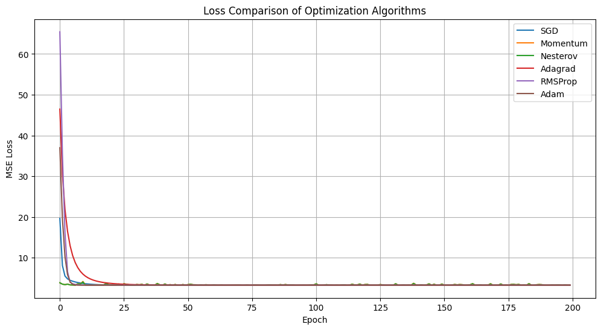
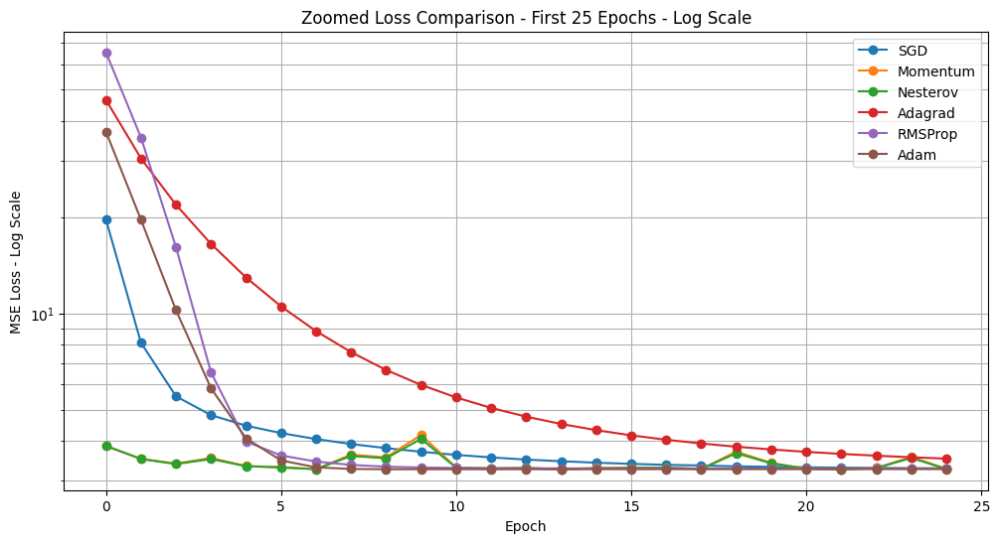
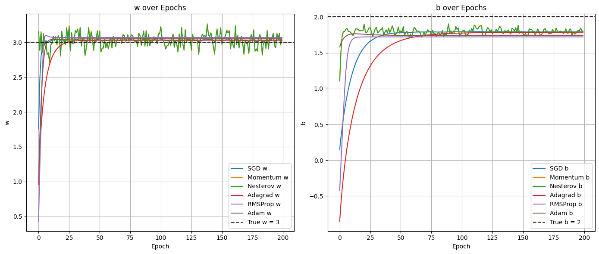

# Optimizer Comparison on Linear Regression

A visual and practical comparison of popular optimization algorithms on a simple Linear Regression problem, implemented from scratch using NumPy.

This project compares how different optimizers update model parameters, reduce loss, and converge toward the true linear function:

$$
y = wx + b
$$

The implemented optimizers are:

- SGD
- Momentum
- Nesterov Accelerated Gradient
- Adagrad
- RMSProp
- Adam

---

## Project Goal

The goal of this project is not only to train a linear regression model, but to understand the behavior of different optimization algorithms visually.

Instead of treating optimizers as black boxes, this project tracks:

- Loss reduction over epochs
- Early-stage convergence behavior
- Parameter updates for $w$ and $b$
- Oscillation and stability of each optimizer
- Final learned regression lines

---

## Problem Setup

The dataset is generated from a linear function with noise:

$$
y = 3x + 2 + \text{noise}
$$

The model tries to learn:

$$
\hat{y} = wx + b
$$

The true parameters are:

```text
w = 3
b = 2
```

The objective function is Mean Squared Error:

$$
MSE = \frac{1}{n}\sum_{i=1}^{n}(y_i - \hat{y}_i)^2
$$

---

## Optimizers Implemented

### 1. SGD

Stochastic Gradient Descent updates parameters directly using the gradient:

$$
\theta = \theta - \alpha \nabla J(\theta)
$$

It is simple, stable, and works surprisingly well on this convex regression problem.

---

### 2. Momentum

Momentum accumulates previous gradients to accelerate movement in consistent directions:

$$
v_t = \beta v_{t-1} - \alpha \nabla J(\theta)
$$

$$
\theta = \theta + v_t
$$

It can converge faster than SGD, but may oscillate when gradients are noisy.

---

### 3. Nesterov Accelerated Gradient

Nesterov Momentum computes the gradient at a lookahead position:

$$
\theta_{\text{lookahead}} = \theta + \beta v
$$

This can improve convergence in many problems, but in noisy stochastic settings, it may show stronger oscillation.

---

### 4. Adagrad

Adagrad adapts the learning rate for each parameter based on accumulated squared gradients:

$$
G_t = G_{t-1} + g_t^2
$$

$$
\theta = \theta - \frac{\alpha}{\sqrt{G_t} + \epsilon} g_t
$$

It is stable, but its effective learning rate continuously decreases, which can make convergence slower over time.

---

### 5. RMSProp

RMSProp improves Adagrad by using an exponential moving average of squared gradients:

$$
S_t = \rho S_{t-1} + (1-\rho)g_t^2
$$

It prevents the learning rate from shrinking too aggressively and usually performs well in early convergence.

---

### 6. Adam

Adam combines Momentum and RMSProp:

- Momentum-like moving average of gradients
- RMSProp-like moving average of squared gradients
- Bias correction

It is usually fast and stable in many machine learning problems.

---

## Results

### Overall Loss Comparison

All optimizers eventually converge to a very similar loss value.  
The main difference is visible in the early epochs, where some optimizers reduce the loss much faster than others.



Key observations:

- All optimizers converge successfully.
- Final losses are very close.
- RMSProp and Adam show very fast initial loss reduction.
- Adagrad starts with a larger loss and decreases more gradually.
- SGD remains simple but stable.

---

### Zoomed Loss Comparison - First 25 Epochs

The first 25 epochs are important because most of the sharp loss reduction happens there.  
A log-scale plot makes the early-stage behavior much easier to compare.



Key observations:

- RMSProp drops the loss very aggressively at the beginning.
- Adam also shows fast early convergence.
- SGD quickly reaches a stable region.
- Adagrad decreases more slowly compared to adaptive methods like RMSProp and Adam.
- Nesterov and Momentum are close to the optimum early, but can show small oscillations.

---

### Parameter Convergence

The following plots show how each optimizer updates the parameters $w$ and $b$ over epochs.



The dashed black lines represent the true values:

```text
True w = 3
True b = 2
```

Key observations:

- Most optimizers quickly move toward the correct $w$ value.
- The learned $b$ values approach the true intercept but remain slightly below 2.
- Nesterov shows more oscillation in this experiment.
- SGD is smoother than expected for this simple convex problem.
- Adaptive methods reach the correct region quickly.

---

## Analysis

Although Momentum and Nesterov are often expected to reduce zigzag movement, in this experiment Nesterov shows more visible oscillation.

This can happen because:

- The updates are stochastic.
- Gradients are noisy.
- Momentum accumulates previous gradient directions.
- Nesterov uses a lookahead position, which can amplify movement when gradients fluctuate.

So, Momentum-based optimizers are not always smoother than SGD, especially in noisy sample-wise training.

For this simple Linear Regression problem:

| Optimizer | Early Speed | Stability | Final Result |
|---|---:|---:|---:|
| SGD | Good | Good | Good |
| Momentum | Fast | Medium | Good |
| Nesterov | Fast | Oscillatory | Good |
| Adagrad | Medium | Good | Good |
| RMSProp | Very Fast | Good | Good |
| Adam | Very Fast | Good | Good |

---

## Main Takeaways

- Optimizers can reach similar final performance but follow very different paths.
- Early convergence behavior is easier to understand using zoomed and log-scale loss plots.
- Adam and RMSProp are strong for fast initial convergence.
- SGD can be very competitive on simple convex problems.
- Nesterov is not always smoother in noisy stochastic settings.
- Hyperparameters such as learning rate and momentum coefficient strongly affect optimizer behavior.

---

## Tech Stack

- Python
- NumPy
- Matplotlib
- Jupyter Notebook

---

## Project Structure

```text
optimizer-comparison-linear-regression/
│
├── images/
│   ├── loss_comparison.png
│   ├── zoomed_loss_log.png
│   └── parameters_convergence.png
│
├── optimizer_comparison.ipynb
├── README.md
└── requirements.txt
```

---

## Installation

Clone the repository:

```bash
git clone https://github.com/your-username/optimizer-comparison-linear-regression.git
cd optimizer-comparison-linear-regression
```

Install dependencies:

```bash
pip install -r requirements.txt
```

Run the notebook:

```bash
jupyter notebook optimizer_comparison.ipynb
```

---

## Requirements

```text
numpy
matplotlib
jupyter
```

---

## Future Improvements

Possible improvements for this project:

- Add mini-batch training instead of sample-wise updates
- Compare different learning rates
- Add contour plots of the loss surface
- Visualize optimizer paths in parameter space
- Add animation for parameter updates
- Test optimizers on non-convex functions
- Compare results with PyTorch optimizers

---

## Conclusion

This project shows that optimizer behavior cannot be judged only by final loss.  
Even when all methods converge successfully, their speed, stability, and parameter paths can be very different.

For this Linear Regression experiment, RMSProp and Adam show the fastest early convergence, SGD remains stable and competitive, and Nesterov shows stronger oscillation due to noisy stochastic updates.

The project provides a simple but useful visual foundation for understanding how popular optimization algorithms work under the hood.
